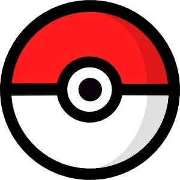

## Table of Contents

1. [Introduction](#introduction)
2. [End user requirements](#end-user-requirements)
3. [Website Owner requirements](#website-owner-requirements)
4. [Wireframe](#wireframe)
5. [Features](#features)
6. [Used_Tools](#used-tools)
7. [Getting Started](#getting-started)
8. [How to Contribute](#how-to-contribute)
9. [Contact](#contact)
10. [License](#license)
11. [Bugs_Fixed](#bugs-fixed)
12. [User_Cases](#user-cases)

# 🎮 Who's That Pokémon? — Guessing Game

This project is a **Pokémon guessing game** built with **HTML**, **CSS**, and **Vanilla JavaScript**, styled with **Bootstrap 5**, and powered by the [PokéAPI](https://pokeapi.co/).

Players are shown a silhouette of a random Pokémon. They type their guess, submit, and reveal if they’re right — complete with hints, scoring, and high-score tracking.

---

## 📂 Project Structure├── index.html # Game UI

---

## 📝 Code Walkthrough

Below, the code is explained line-by-line:  
where it comes from, why it was written, how to replicate it, and how to test/debug.
<head>
  <meta charset="UTF-8">
  <meta name="viewport" content="width=device-width, initial-scale=1.0">
  <title>Pokemon Guess</title>
Sets character encoding, makes the game responsive, and gives it a title.

Source: Standard HTML5 boilerplate.

🐛 Debug tip: Without viewport meta, the page may zoom weirdly on mobile.

html
Copy code
  <!-- Bootstrap CSS -->
  <link href="https://cdn.jsdelivr.net/npm/bootstrap@5.0.0-beta2/dist/css/bootstrap.min.css" rel="stylesheet">
Imports Bootstrap for grid, buttons, spacing utilities.

Source: Bootstrap CDN.

✅ To replicate: Copy link from Bootstrap’s docs.

html
Copy code
  <!-- Font Awesome -->
  <link rel="stylesheet" href="https://cdnjs.cloudflare.com/ajax/libs/font-awesome/5.15.0/css/all.min.css">
Allows optional use of icons.

Source: Font Awesome CDN.

html
Copy code
</head>
<body>
  <h1 class="text-center my-4">Who's That Pokémon?</h1>
Game header styled with Bootstrap classes.

✅ Replicate by using <h1> plus Bootstrap spacing utilities.

html
Copy code

  

    

Bootstrap layout: center the game box.

Source: Bootstrap Grid.

html
Copy code

  

Displays the Pokémon (or pokeball fallback).

✅ Debug tip: Check your console if the image doesn’t load → wrong path.

html
Copy code
<input type="text" id="pokemon-guess" class="form-control mb-3" placeholder="Enter Pokémon Name">
Input box for guesses. Uses Bootstrap form styling.

html
Copy code
<button id="submit-guess" class="btn btn-primary mb-2">Submit Guess</button>
<button id="next-pokemon" class="btn btn-success mb-2">Next Pokémon</button>
<button id="new-game" class="btn btn-secondary mb-3">New Game</button>
Buttons linked to game logic in script.js.

✅ Debug tip: Ensure IDs match exactly with your JavaScript event listeners.

html
Copy code

  
Score: 0

  
High Score: 0

Displays results and score tracking.

html
Copy code

</body>
</html>
Loads your game logic.

✅ Debug tip: If the game doesn’t start, check console for “script not found”.

2️⃣ CSS — style.css
css
Copy code
body { background: #0d1117; color: #e6edf3; }
Dark theme inspired by GitHub Dark.

✅ Debug tip: If text is unreadable, check body styles.

css
Copy code
#pokemon-image {
  display: flex;
  align-items: center;
  justify-content: center;
  min-height: 280px;
  background: rgba(255,255,255,0.04);
  border-radius: 1rem;
}
Centers the Pokémon, gives a card effect.

✅ Replicate: Use display: flex; align-items: center; justify-content: center;.

css
Copy code
.silhouette { filter: brightness(0) contrast(100%); transform: scale(0.98); }
Creates the blacked-out silhouette.

Source: MDN — filter.

3️⃣ JavaScript — script.js
Your script powers the game.

Key parts:
js
Copy code
const imageEl = document.querySelector('#pokemon-image img');
Selects the Pokémon image element.

js
Copy code
const MIN_ID = 1;
const MAX_ID = 1010;
Range of Pokémon (Gen 1–9).

Source: Pokédex # up to 1010.

js
Copy code
async function fetchPokemon(id) {
  const url = `https://pokeapi.co/api/v2/pokemon/${id}`;
  const res = await fetch(url);
  const data = await res.json();
Fetches Pokémon data from PokéAPI.

✅ Debug tip: Use browser devtools → Network tab to see if requests fail.

js
Copy code
function applySilhouette(on) { ... }
Toggles the black silhouette class on the Pokémon image.

js
Copy code
function checkGuess() { ... }
Compares user input against the actual Pokémon name.

Normalizes spelling, case, accents, gender symbols.

Gives hints (first letter + type).

js
Copy code
function setScore(newScore) { ... }
Updates the score and saves high score to localStorage.

✅ Debug tip: Inspect → Application → Local Storage in your browser.

js
Copy code
window.addEventListener('DOMContentLoaded', () => {
  loadRandomPokemon();
});
Starts the first round when the page loads.

🔍 Testing & Debugging
Load in Browser

Open index.html in Chrome/Firefox.

Pokémon should load within ~1s (depending on PokéAPI).

Check Console (F12 → Console)

Look for errors like “Failed to fetch” → means PokéAPI is down or blocked.

Missing images → check assets/images/ paths.

Simulate Bugs

Disconnect WiFi → see error handling (pokeball.png fallback).

Enter wrong names → confirm hints show correctly.

Refresh page → ensure high score persists.

Mobile Testing

Resize browser or use Chrome DevTools → Device Toolbar.

Check input + buttons remain usable.

📚 Sources & Credits
PokéAPI → https://pokeapi.co/

Bootstrap 5 → https://getbootstrap.com/

Font Awesome → https://fontawesome.com/

Inspired by open-source projects:

guess-the-pokemon by CarolinaAbreu19

who-is-that-pokemon by marinsborg

🚀 How to Run
bash
Copy code
git clone https://github.com/your-username/pokemon-guess-game.git
cd pokemon-guess-game
Open index.html in your browser.

Or host online via GitHub Pages or Netlify.

